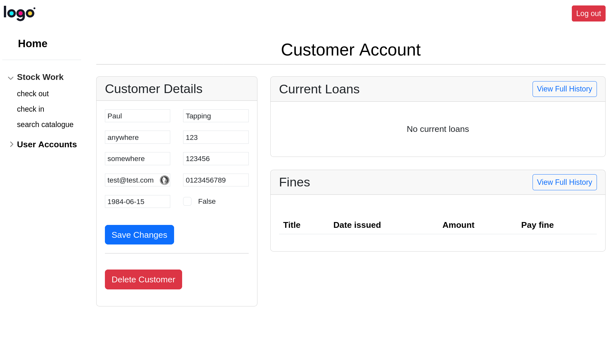
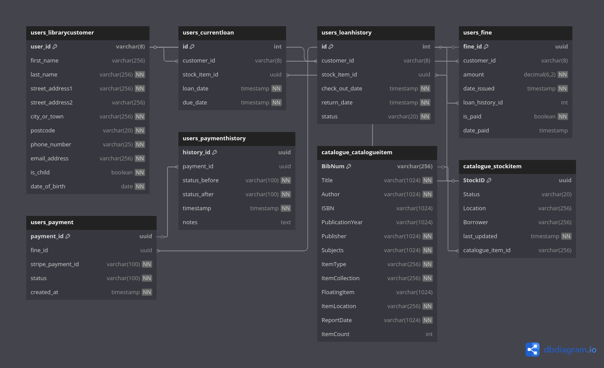
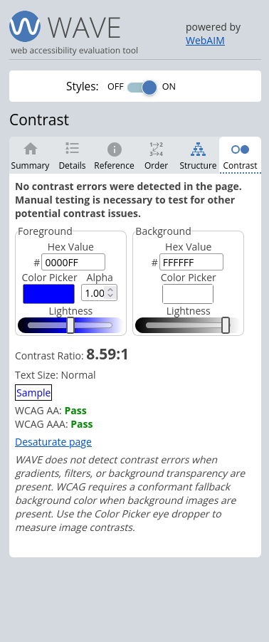
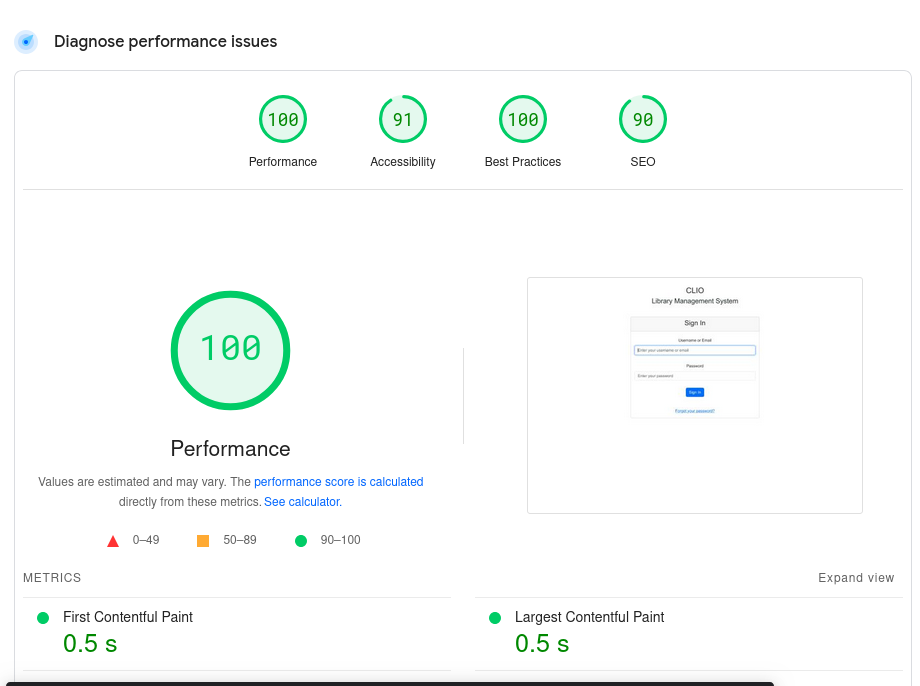

# Milestone Project :four:
 
This is my milestone four project for the Code Institute's 'Level 5 Diploma in Web Application Development.' The aim of this project is to design, develop, and implement a full-stack web application inluding back and front end design, and integrating an ePayment system via online service Stripe. This project will take the form of a comprehensive library management web application using the python framework Django, called CLIO. Named after the greek goddess of knowledge and scholarship (it could also be a fun acronym, perhaps Clever Library Infomation Organisation). CLIO will allow librarians and library staff to create, edit, and manage catalog records, check in and return items, and manage user accounts and stock control, providing an efficient, accessible tool for library inventory and user management. CLIO is aimed at libraries seeking a modern, flexible system to streamline their cataloging, inventory management, and user records, while also offering a user-friendly experience for library staff. This project will focus on the library staff and librarians use of the app, however possible future development could extend this project further to encompass a library customer access whereby users could login remotely, access their account information, and interact with the library system.   

### Testing logins: 

The following accounts can be used for the purposes of testing and assessing the front-end of the project: 

| username | password | privilege level |
|------|------|---------|
test_superuser | loginrequired | superuser
test_admin_privs | test123 | admin
test_librarian_privs | loginrequired | librarian
test_staff_privs | loginrequired | staff

Please be aare that you will not be able to sign-up to the application and will, necessarily, have to log-in using the above details. The system is not designed for open access from the public and is designed with the concept of being a system front-line staff would access, necessitating corporate-level control over sign-up and account creation. The current privilege heirarchy is Admin > Librarians > Staff: 

#### Admin: 

Full control of the system including creating, deleting and amending all records within the system and in the admin panel. This would be utilised by administrative staff, or IT departments. 

#### Librarian :

Full access to read, write and destroy records within the system, limited access to adminsitrative function such as creating new staff members. 

#### Staff: 

Read access to all system information with limited create and write permissions and no admin access. Frontline staff would not be expected to, for example, create CatalogueItems, as these would be created on purchase of items and involved other systems outside the purview of this project.  

---

## Project Goals

#### User Goals:

- Access and search a library catalogue efficiently.
- Reserve, check out, and return items with ease. Access account information, including due dates and item availability. 
- View account history and any current items checked out.

#### Site Operator Goals:
        
- Maintain an organized and accessible record of the library's items.
- Track the availability and status of items to ensure proper circulation.
- Add, edit, and remove catalogue and user data to keep the library’s database accurate.
- Efficiently manage user accounts and item inventory.

#### Developer Goals:
        
- Create an intuitive and user-friendly application for both users and library staff.
- Ensure that the project is scalable and easy to maintain, with clear, well-documented code.
- Implement a reliable check-in/check-out system for managing item circulation.
- Ensure compatibility across devices with a responsive design.

---

### User Experience

#### Front End

The user interface will leverage bootstrap5 to offer a stream-lined, visually appealing experience. To maintain consistency across pages, the project uses Django’s template inheritance, creating a base template with core elements (such as navigation). This approach enables each page to extend the base, ensuring a uniform layout and reducing code duplication, making for a cleaner, more maintainable front-end design.

#### Back End

The database for this project uses postgreSQL providing a robust and powerful solution for managing library catalog entries, inventory, and user records. Django's ORM allows for seamless database interactions, enabling complex queries, and maintaining data integrity across multiple related entities, such as catalog entries, inventory items, and user information. This setup ensures that catalog data and user records are efficiently managed and updated as required.

### Target Audience

- Library Staff and Managers: Seeking efficient ways to manage library inventory and keep track of catalog details.
- Library Members: Who will primarily interact with the search functionalities, browse catalog listings, and view availability.
- Community Libraries: Looking to modernize and streamline catalog management.
- Small Educational Institutions: Interested in organizing and managing a lending library for students and faculty.

### User Requirements and Expectations

- Easy, intuitive navigation
- Secure handling of user and item data
- Accessible interface for all types of users
- Ability to browse the catalog and check item availability
- Ability for staff to add, edit, and check in/out catalog items

---

### User Stories

#### First Time User

- As a first-time user, I want a clear homepage with an overview of catalog items and availability.
- As a first-time user, I want to search and browse the catalog based on title, author, or availability.
- As a first-time user, I want an intuitive experience while viewing catalog or account details.

#### Returning User

- As a returning user, I want quick access to search and view catalog items.
- As a returning user, I want to view and update details related to library items, like availability and check-out dates.
- As a returning user, I want to log in securely to manage library inventory and users.

#### Site Owner

- As a site owner, I want to manage and view inventory status with ease.
- As a site owner, I want to allow library members to browse and check the availability of items.
- As a site owner, I want to ensure data security for both catalog and user records.

---

Identified Tasks/Needs the Website Should Fulfill

| Task/Need	| Importance (1 -5) | 
|---------------|--------------|
Clear and accessible navigation	| 5
Responsiveness across devices |	5
Browse and search library catalog | 5
Manage user accounts securely |	5
Add, edit, and update catalog and stock records | 4
Update availability for catalog items | 4
Generate reports or summaries on inventory status | 3
Secure user login and account management | 5
Direct 404 links to home if catalog or user not found | 4

### Accessibility

In building the library app, several accessibility features to keep in mind:

- Use of semantic HTML5 elements for improved structure.
- Descriptive link text to aid navigation.
- ARIA labels for interactive elements to ensure screen reader compatibility.
- Appropriate color contrast for readability.
- Legible, accessible fonts for ease of reading.
- Alternative text for any non-decorative images.
- Clearly labeled, accessible forms to improve user interaction.

---

## Database Structure

    LibraryCustomer:
        Has many CurrentLoan records.
        Has many LoanHistory records.
        Has many Fine records.

    CurrentLoan:
        Belongs to one LibraryCustomer.
        Belongs to one StockItem.

    LoanHistory:
        Belongs to one LibraryCustomer.
        Belongs to one StockItem.

    Fine:
        Belongs to one LibraryCustomer.
        Belongs to one LoanHistory.

    Payment:
        Belongs to one Fine.

    PaymentHistory:
        Belongs to one Payment.

    CatalogueItem:
        Has many StockItem records.

    StockItem:
        Belongs to one CatalogueItem.
        Has one CurrentLoan record (if on loan).

### Schema Diagram

## Database Models

### Users Models

#### LibraryCustomer

| Field	| Data Type	| Constraints/Notes |
|----------|----------|-------------|
user_id | CharField | Primary key, max_length=8, unique, auto-generated (e.g., A0000001)
first_name | CharField | max_length=256, optional
last_name | CharField | max_length=256, required
street_address1	| CharField	| max_length=256, required
street_address2	| CharField | max_length=256, optional
city_or_town | CharField | max_length=256, required
postcode | CharField | max_length=20, required
phone_number | CharField | max_length=25, required
email_address | CharField | max_length=256, required
is_child | BooleanField | Required
date_of_birth | DateField | Required

#### CurrentLoan

Field | Data Type | constraints/Notes |
|----|-------|-------|
id | AutoField | Primary key, auto-increment
customer | ForeignKey | References LibraryCustomer, on_delete=CASCADE
stock_item | ForeignKey | References StockItem, on_delete=CASCADE
loan_date | DateTimeField | Auto-set to current timestamp on creation
due_date | DateTimeField | Required

#### LoanHistory

Field | Data Type | Constraints/Notes |
|-----------|-------------|------------|
id | AutoField | Primary key, auto-increment
customer | ForeignKey | References LibraryCustomer, on_delete=CASCADE
stock_item | ForeignKey |References StockItem, on_delete=CASCADE
check_out_date | DateTimeField | Required
return_date | DateTimeField | Required
status | CharField | Choices: completed, overdue, lost

#### Fine

Field | Data Type | Constraints/Notes |
|----------|-------------|------------|
fine_id | UUIDField | Primary key, auto-generated
customer | ForeignKey | References LibraryCustomer, on_delete=CASCADE
amount |DecimalField | max_digits=6, decimal_places=2
date_issued | DateTimeField | Auto-set to current timestamp on creation
loan_history | OneToOneField | References LoanHistory, on_delete=CASCADE, unique
is_paid | BooleanField | Default: False
date_paid | DateTimeField | Optional

#### Payment

Field | Data Type | Constraints/Notes |
|------------|----------------|--------|
payment_id | UUIDField | Primary key, auto-generated
fine | ForeignKey | References Fine, on_delete=CASCADE
stripe_payment_id | CharField | max_length=100, required
status | CharField | Choices: PENDING, PROCESSING, COMPLETED, FAILED, REFUNDED
created_at | DateTimeField | Auto-set to current timestamp on creation

#### PaymentHistory

Field | Data Type | Constraints/Notes |
|-------------|-----------|-------------|
history_id | UUIDField | Primary key, auto-generated
payment | ForeignKey | References Payment, on_delete=CASCADE
status_before | CharField | max_length=100, required
status_after | CharField | max_length=100, required
timestamp | DateTimeField | Auto-set to current timestamp on creation
notes | TextField | Optional

### Catalogue Models

#### CatalogueItem

Field | Data Type | Constraints/Notes | 
|-------------|------------|----------|
BibNum | CharField | Primary key, max_length=256, required
Title | CharField | max_length=1024, required
Author | CharField | max_length=1024, required
ISBN | CharField | max_length=1024, optional
PublicationYear | CharField | max_length=1024, optional
Publisher | CharField | max_length=1024, required
Subjects | CharField | max_length=1024, required
ItemType | CharField | max_length=256, required
ItemCollection | CharField | max_length=256, required
FloatingItem | CharField | max_length=1024, optional
ItemLocation | CharField | max_length=256, required
ReportDate | CharField | max_length=1024, required
ItemCount | IntegerField | Default: 0

#### StockItem

Field | Data Type | Constraints/Notes | 
|---------|------------|--------------|
StockID	| UUIDField	| Primary key, auto-generated
Status | CharField | Choices: on_loan, available, overdue, maintenance, discarded, missing
Location | CharField | max_length=256, optional
Borrower | CharField | max_length=256, optional
last_updated | DateTimeField | Auto-updated on save
catalogue_item | ForeignKey | References CatalogueItem, on_delete=CASCADE

---

### Site Features

1. User Management

Library Customers

    Registration: Users (library customers) can be added to the system with details like:

        user_id (auto-generated, e.g., A0000001).
        Personal details (first_name, last_name, email_address, etc.).
        Address (street_address1, city_or_town, postcode, etc.).
        Date of birth and child status (is_child).

    Fine Management:

        Customers can accumulate fines for overdue or lost items.
        Fines are capped at a maximum amount (FINE_CAP).
        Customers cannot borrow new items if their unpaid fines exceed the cap.

    Loan History:

        Tracks all past loans, including check-out and return dates.
        Records the status of each loan (completed, overdue, lost).

2. Catalogue Management

Catalogue Items

    Books and Other Items:

        Each item in the library catalogue is represented by a CatalogueItem.
        Fields include Title, Author, ISBN, Publisher, Subjects, ItemType, etc.

    Stock Items:

        Individual copies of catalogue items are represented by StockItem.
        Tracks the status of each copy (available, on_loan, overdue, maintenance, etc.).
        Links to the parent CatalogueItem.

3. Loan Management

Current Loans

    Borrowing:

        Customers can borrow items (StockItem), creating a CurrentLoan record.
        Each loan has a loan_date and due_date.

    Overdue Loans:

        The system checks if a loan is overdue and updates its status.

    Returning Items:

        When an item is returned, the CurrentLoan is moved to LoanHistory.

Loan History

    Tracking:

        Stores historical data about loans, including:

            check_out_date and return_date.
            Loan status (completed, overdue, lost).

4. Fine and Payment Management
Fines

    Issuing Fines:

        Fines are issued for overdue or lost items.
        Each fine is linked to a LoanHistory record.

    Fine Details:

        Includes amount, date_issued, is_paid, and date_paid.

Payments

    Payment Processing:

        Customers can pay fines using a payment system (e.g., Stripe).
        Payments are recorded in the Payment model.

    Payment History:

        Tracks changes in payment status (PENDING, COMPLETED, FAILED, etc.).
        Stores notes and timestamps for each status change.

5. Search and Filtering

    Catalogue Search:

        Users can search for items by Title, Author, Publisher, etc.
        Results are displayed in a user-friendly format.

    User Search:

        Librarians can search for users by user_id, first_name, last_name, etc.

6. Admin and Reporting

    Admin Interface:

        Built-in Django admin interface for managing:

            Users, catalogue items, loans, fines, and payments.

6. Payment Integration

    Stripe Integration:

        Handles payments for fines.
        Supports test mode for development.
        Tracks payment status and history.

7. Security and Permissions

    Authentication:

        Users must log in to access certain features (e.g., borrowing items, paying fines).

    Permissions:

        Different roles (e.g., librarians, customers) have different access levels.

8. Deployment and Hosting

    Production Environment:

        Uses PostgreSQL for the database.
        Deployed to a platform like Heroku, AWS, or DigitalOcean.

    Environment Variables:

        Sensitive data (e.g., Stripe API keys) stored in environment variables.

---

## Design

1. Typography

Font Choice: Roboto, A clean, legible font, was chosen early in the project to ensure readability across all devices and screen sizes. The font family used is sans-serif (e.g., Arial, Helvetica, or Roboto), which is modern, neutral, and easy to read.

    Font Hierarchy:

        Headers: Bold and slightly larger to distinguish sections and improve scannability.

        Body Text: Standard size with adequate line spacing for comfortable reading.

        Tables: Monospaced fonts (e.g., Courier New) are avoided in favor of proportional fonts for better alignment and readability.

2. Color Scheme

    Neutral Palette: A neutral color palette (e.g., shades of gray, white, and black) was chosen to keep the interface clean and professional.

    Accent Colors: Subtle accent colors (e.g., blue or green) are used sparingly for interactive elements like buttons and links to draw attention without overwhelming the user.

    Corporate Branding: The design is intentionally minimal to allow for easy integration of institutional branding (e.g., logos, colors) in the future.

3. Layout

    Header:

        The top header features a dummy logo as a placeholder, with the intention that it will be replaced by the corporate branding of the implementing institution.

        The header is clean and unobtrusive, providing a consistent anchor point for navigation.

    Side Panel:

        A side panel is used for the main navigation, providing easy access to key sections of the application (e.g., catalogue, users, loans, fines).

        The side panel is collapsible to maximize screen space when needed.

    Main Content Area:

        The main content area is designed to be flexible, accommodating various types of information (e.g., tables, forms, details pages).

        Bootstrap’s grid system ensures a responsive layout that adapts to different screen sizes.

4. Navigation

    Ease of Use:

        The side-panel navigation is designed for ease of use, with clear labels and intuitive grouping of related features.

        Active navigation items are highlighted to provide visual feedback.

5. Responsiveness

    Mobile-Friendly:

        The design is fully responsive, ensuring a seamless experience on desktops, tablets, and mobile devices.

        The side panel collapses into a hamburger menu on smaller screens to save space.

6. Custom Branding:

        The design is intentionally minimal to allow for easy integration of institutional branding (e.g., logos, colors, fonts).

### Technologies and Tools used

#### Languages/Frameworks/Libraries

- **CSS3**
- **HTML5**
- **javaScript**
- **jQuery**
- **bootstrap**
- **django**
- **python**
- **Markdown**

#### Tools

- **[Tilix](https://gnunn1.github.io/tilix-web/)**
- **[Google Chrome](https://www.chrome.com/)**
- **[Firefox](https://www.firefox.com)**
- **[git](https://git-scm.com/)**
- **[GitHub](https://www.github.com)**
- **[Google Fonts](https://fonts.google.com/)**
- **[amiresponsive](https://ui.dev/amiresponsive)**

---

## :microscope: Testing

### Testing Procedure

Manual testing, or user testing, was conducted throughout the development process by performing actions such as registering library customers, adding items to the catalogue, processing loans and returns, handling fines, and making payments through Stripe. Each feature was thoroughly tested across different screen sizes and browsers before moving on to the next development phase.

Automated testing was implemented using Django's built-in testing framework and utilised the package Coverage in order to generate html reports of the testing results. The testing achieved 80% coverage with 25 passing tests out of 45 total tests written. The testing suite focused primarily on model validation and relationships, particularly around the CatalogueItem and StockItem models. While not all tests are currently passing, the coverage achieved provides reasonable confidence in the core functionality of the system.

Performance and accessibility testing was carried out using Lighthouse and WAVE, ensuring the application meets modern web standards and remains accessible to all users, including those using screen readers or other assistive technologies. The Stripe payment integration was extensively tested using Stripe's test card numbers to ensure robust payment processing.

#### Coverage Report

#### WAVE

accessibility testing with wave, unsuprisingly for a predominantly black and white site results in the following: 

#### Lighthouse

During the Lighthouse testing process, the tool was unable to bypass the site's login validation, limiting its assessment to the login screen only. However, the login screen serves as a representative sample of the site's overall design and performance characteristics. Its structure, visual elements, and resource load provide a reliable approximation of the user experience and technical performance across the rest of the application. This allows us to infer that the findings from the login screen are indicative of the broader site's design consistency and weight.

## Functional testing

### User Management Tests

| Test | Verified |
|------|-----------|
| Create new library customer with valid data | ✓ |
| Create new library customer with invalid data (should fail) | ✓ |
| View customer details including personal information and address | ✓ |
| Edit existing customer details | ✓ |
| Delete existing customer | ✓ |
| Verify auto-generation of user_id in correct format | ✓ |
| View customer's current fine balance | ✓ |
| Verify customer cannot borrow when fines exceed cap | ✓ |
| View complete loan history for customer | ✓ |

### Catalogue Management Tests

| Test | Verified |
|------|-----------|
| Add new catalogue item with all required fields | ✓ |
| Add new stock item linked to catalogue item | ✓ |
| Edit catalogue item details | ✓ |
| Delete catalogue item (should delete associated stock items) | ✓ |
| Update stock item status (available, on_loan, etc.) | ✓ |
| View all stock items for a catalogue item | ✓ |
| Search catalogue by title | ✓ |
| Search catalogue by author | ✓ |

### Loan Management Tests

| Test | Verified |
|------|-----------|
| Create new loan for eligible customer | ✓ |
| Attempt loan for customer with excessive fines (should fail) | ✓ |
| Return item and verify status update | ✓ |
| Check for automatic fine generation on overdue items | ✓ |
| View all current loans for a customer | ✓ |
| Verify due date is correctly calculated | ✓ |
| Check overdue status is automatically updated | ✓ |
| Process lost item report | ✓ |

### Fine and Payment Tests

| Test | Verified |
|------|-----------|
| Automatic fine generation for overdue items | ✓ |
| Manual fine creation for lost/damaged items | ✓ |
| Process payment through Stripe | ✓ |
| Process payment with test card numbers | ✓ |
| View payment history for customer | ✓ |
| Verify fine cap implementation | ✓ |
| Check fine payment status update | ✓ |
| Generate payment receipt | ✓ |
| Handle failed payment gracefully | ✓ |

### Admin and Security Tests

| Test | Verified |
|------|-----------|
| Admin login functionality | ✓ |
| Admin user management capabilities | ✓ |
| Admin catalogue management | ✓ |
| Admin fine management | ✓ |
| Access restricted pages without login (should fail) | ✓ |
| Password reset functionality | ✓ |
| Verify role-based access controls | ✓ |
| Secure routing and URL validation | ✓ |

### Responsive Design Tests

| Test | Verified |
|------|-----------|
| Responsive layout on tablets | ✓ |
| Responsive layout on desktop | ✓ |
| Navigation menu responsiveness | ✓ |
| Form layout on different screen sizes | ✓ |
| Table responsiveness | ✓ |
| Font scaling across devices | ✓ |

### User Stories Testing

#### First Time User Testing: 

- As a first-time user, I want a clear homepage with an overview of catalog items and availability.
- As a first-time user, I want to search and browse the catalog based on title, author, or availability.
- As a first-time user, I want an intuitive experience while viewing catalog or account details.

#### Returning User Testing: 

- As a returning user, I want quick access to search and view catalog items.
- As a returning user, I want to view and update details related to library items, like availability and check-out dates.
- As a returning user, I want to log in securely to manage library inventory and users.

#### Site Owner Testing: 

- As a site owner, I want to manage and view inventory status with ease.
- As a site owner, I want to allow library members to browse and check the availability of items.
- As a site owner, I want to ensure data security for both catalog and user records.

### Desktop

---

### Bug fixes

------------
---------------
-------------
--------------
---------------------
-----------------------------
--------------------------------
-----------------------------

## :loudspeaker: Deployment

---
 
---

## :heart: Credits and Acknowledgments

---

https://img.logoipsum.com/332.svg
My wonderful family!

